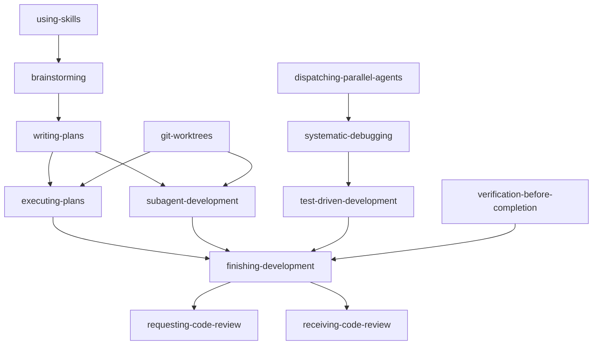

# Pi Superpowers Skill Set

A comprehensive set of discipline-enforcing process skills adapted from OpenCode's superpowers for Pi.

## Quick Start

1. **Install:** These skills are already in `~/.pi/agent/skills/superpowers/`
2. **Use:** Type `/skill:name` to load a skill, or let Pi auto-detect based on context
3. **Learn:** Start with `using-skills` to understand the skill system

## Available Skills

### Meta Skill
| Skill | Description |
|-------|-------------|
| **using-skills** | Use when starting any conversation - establishes how to find and use skills |

### Process Skills (Start Here)
| Skill | Description |
|-------|-------------|
| **brainstorming** | Use when creating features, building components, adding functionality |
| **writing-plans** | Use when you have a spec or requirements for a multi-step task |
| **executing-plans** | Use when you have a written implementation plan for separate session |
| **subagent-development** | Use when executing implementation plans in current session |

### Quality Discipline Skills
| Skill | Description |
|-------|-------------|
| **test-driven-development** | Use when implementing any feature or bugfix |
| **systematic-debugging** | Use when encountering any bug, test failure, or unexpected behavior |
| **verification-before-completion** | Use when you think you're done |

### Workflow Skills
| Skill | Description |
|-------|-------------|
| **git-worktrees** | Use when starting feature work that needs isolation |
| **finishing-development** | Use when implementation is complete, all tests pass |
| **dispatching-parallel-agents** | Use when facing 2+ independent tasks |

### Code Review Skills
| Skill | Description |
|-------|-------------|
| **requesting-code-review** | Use when code is ready for review |
| **receiving-code-review** | Use when receiving code review feedback |

### Meta-Creation Skill
| Skill | Description |
|-------|-------------|
| **writing-skills** | Use when creating new skills, editing existing skills |

## Common Workflows

### Building a New Feature

```
1. /skill:brainstorming           → Explore requirements, get design approval
2. /skill:writing-plans           → Create detailed implementation plan
3. /skill:git-worktrees           → Set up isolated workspace
4. /skill:subagent-development    → Execute plan with quality gates
5. /skill:finishing-development   → Complete and merge
```

### Fixing a Bug

```
1. /skill:systematic-debugging    → Find root cause
2. /skill:test-driven-development → Write failing test, fix, verify
3. /skill:finishing-development   → Complete and merge
```

### Handling Multiple Failures

```
1. /skill:dispatching-parallel-agents  → Identify independent domains
2. /skill:systematic-debugging        → Debug each in parallel
3. /skill:finishing-development       → Integrate all fixes
```

## Skill Dependencies



## Supporting Files

Some skills include supporting reference files:

- **test-driven-development/**: `testing-anti-patterns.md`
- **systematic-debugging/**: `root-cause-tracing.md`, `defense-in-depth.md`, `condition-based-waiting.md`

## Key Principles

1. **Always check for skills first** - Before any action, see if a skill applies
2. **Follow skills exactly** - Rigid skills (TDD, debugging) must not be adapted
3. **Skills are trigger-focused** - Descriptions describe WHEN to use, not what they do
4. **Progressive disclosure** - Only descriptions in system prompt, full content loaded on demand

## Migration Notes

This skill set was adapted from OpenCode's superpowers with the following changes:
- Renamed `using-superpowers` → `using-skills`
- Renamed `finishing-a-development-branch` → `finishing-development`
- Renamed `using-git-worktrees` → `git-worktrees`
- Renamed `subagent-driven-development` → `subagent-development`
- Converted all Graphviz flowcharts to Mermaid
- Updated path conventions (`.pi/CLAUDE.md`, `docs/plans/`, etc.)
- Removed `superpowers:` prefixes from skill references
- Added hybrid subagent strategy for Pi compatibility

## License

These skills are adapted from OpenCode's superpowers. Original copyright applies.
