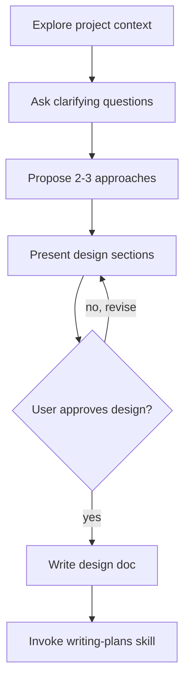
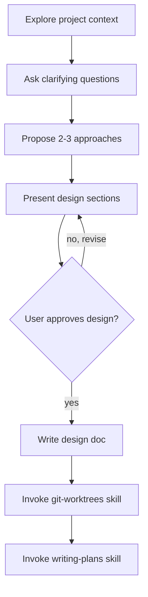

# Plan-Worktree Integration Implementation Plan

> **For AI:** REQUIRED SUB-SKILL: Use executing-plans to implement this plan task-by-task.

**Goal:** Integrate writing-plans with git-worktrees so worktree is created before writing implementation plans.

**Architecture:** brainstorming creates worktree after design approval, then invokes writing-plans inside the worktree. Minimal changes to existing skills - just updating flow and documentation.

**Tech Stack:** Markdown skill files

---

### Task 1: Update brainstorming Skill

**Files:**
- Modify: `/Users/FLP9damarpramuditya/.pi/agent/skills/superpowers/brainstorming/SKILL.md`

**Step 1: Update Checklist section**

Find:
```markdown
## Checklist

You MUST create a task for each of these items and complete them in order:

1. **Explore project context** — check files, docs, recent commits
2. **Ask clarifying questions** — one at a time, understand purpose/constraints/success criteria
3. **Propose 2-3 approaches** — with trade-offs and your recommendation
4. **Present design** — in sections scaled to their complexity, get user approval after each section
5. **Write design doc** — save to `docs/plans/YYYY-MM-DD-<topic>-design.md`
6. **Transition to implementation** — invoke writing-plans skill to create implementation plan
```

Replace with:
```markdown
## Checklist

You MUST create a task for each of these items and complete them in order:

1. **Explore project context** — check files, docs, recent commits
2. **Ask clarifying questions** — one at a time, understand purpose/constraints/success criteria
3. **Propose 2-3 approaches** — with trade-offs and your recommendation
4. **Present design** — in sections scaled to their complexity, get user approval after each section
5. **Write design doc** — save to `docs/plans/YYYY-MM-DD-<topic>-design.md`
6. **Create worktree** — invoke git-worktrees skill to create isolated workspace
7. **Transition to implementation** — invoke writing-plans skill (inside worktree) to create implementation plan
```

**Step 2: Update Process Flow diagram**

Find:


Replace with:


**Step 3: Update "After the Design" section**

Find:
```markdown
## After the Design

**Documentation:**
- Write the validated design to `docs/plans/YYYY-MM-DD-<topic>-design.md`

**Implementation:**
- Invoke the writing-plans skill to create a detailed implementation plan
- Do NOT invoke any other skill. writing-plans is the next step.
```

Replace with:
```markdown
## After the Design

**Documentation:**
- Write the validated design to `docs/plans/YYYY-MM-DD-<topic>-design.md` (in main repo)

**Worktree Setup:**
- Invoke the git-worktrees skill to create an isolated workspace
- This ensures the implementation plan lives in the worktree from the start

**Implementation:**
- Invoke the writing-plans skill (inside the worktree) to create a detailed implementation plan
- Do NOT invoke any other skill. git-worktrees → writing-plans is the next step.
```

**Step 4: Verify changes**

Run: `cat /Users/FLP9damarpramuditya/.pi/agent/skills/superpowers/brainstorming/SKILL.md | grep -A 8 "## Checklist"`
Expected: Shows updated 7-item checklist ending with worktree step

---

### Task 2: Update writing-plans Skill

**Files:**
- Modify: `/Users/FLP9damarpramuditya/.pi/agent/skills/superpowers/writing-plans/SKILL.md`

**Step 1: Remove worktree context line from Overview**

Find:
```markdown
**Announce at start:** "I'm using the writing-plans skill to create the implementation plan."

**Context:** This should be run in a dedicated worktree (created by git-worktrees skill).

**Save plans to:** `docs/plans/YYYY-MM-DD-<feature-name>.md`
```

Replace with:
```markdown
**Announce at start:** "I'm using the writing-plans skill to create the implementation plan."

**Prerequisite:** Should be run in a dedicated worktree (created by git-worktrees skill, typically invoked by brainstorming).

**Save plans to:** `docs/plans/YYYY-MM-DD-<feature-name>.md`
```

**Step 2: Add worktree check section after Overview**

Find:
```markdown
**Save plans to:** `docs/plans/YYYY-MM-DD-<feature-name>.md`

## Bite-Sized Task Granularity
```

Replace with:
```markdown
**Save plans to:** `docs/plans/YYYY-MM-DD-<feature-name>.md`

## Worktree Verification

**If invoked directly (not via brainstorming):**

Check if currently in a worktree:
```bash
git worktree list | grep -q "$(pwd)" && echo "in worktree" || echo "not in worktree"
```

**If not in worktree:**
- Ask user: "Not in a worktree. Continue here or create one first with git-worktrees skill?"
- Respect user's choice - small/simple plans may not need isolation

## Bite-Sized Task Granularity
```

**Step 3: Verify changes**

Run: `cat /Users/FLP9damarpramuditya/.pi/agent/skills/superpowers/writing-plans/SKILL.md | grep -A 3 "## Worktree"`
Expected: Shows new worktree verification section

---

### Task 3: Update git-worktrees Skill Integration Section

**Files:**
- Modify: `/Users/FLP9damarpramuditya/.pi/agent/skills/superpowers/git-worktrees/SKILL.md`

**Step 1: Update "Called by" list**

Find:
```markdown
## Integration

**Called by:**
- **brainstorming** (Phase 4) - REQUIRED when design is approved and implementation follows
- **subagent-development** - REQUIRED before executing any tasks
- **executing-plans** - REQUIRED before executing any tasks
- Any skill needing isolated workspace
```

Replace with:
```markdown
## Integration

**Called by:**
- **brainstorming** (Phase 6) - REQUIRED after design approval, before writing-plans
- **subagent-development** - REQUIRED before executing any tasks
- **executing-plans** - REQUIRED before executing any tasks
- Any skill needing isolated workspace

**Typical flow:**
```
brainstorming → git-worktrees → writing-plans → executing-plans
```
```

**Step 2: Verify changes**

Run: `cat /Users/FLP9damarpramuditya/.pi/agent/skills/superpowers/git-worktrees/SKILL.md | grep -A 10 "## Integration"`
Expected: Shows updated integration section with brainstorming at Phase 6 and flow diagram

---

### Task 4: Final Verification

**Step 1: Verify all files were modified**

Run:
```bash
echo "=== brainstorming checklist ===" && grep -A 8 "## Checklist" /Users/FLP9damarpramuditya/.pi/agent/skills/superpowers/brainstorming/SKILL.md | head -10
echo ""
echo "=== writing-plans worktree section ===" && grep -A 8 "## Worktree" /Users/FLP9damarpramuditya/.pi/agent/skills/superpowers/writing-plans/SKILL.md | head -12
echo ""
echo "=== git-worktrees integration ===" && grep -A 12 "## Integration" /Users/FLP9damarpramuditya/.pi/agent/skills/superpowers/git-worktrees/SKILL.md | head -15
```

Expected: All three sections show updated content

**Step 2: Manual review**

Read each modified file to verify changes are correct and consistent.

---

## Summary

| Task | File | Changes |
|------|------|---------|
| 1 | brainstorming/SKILL.md | Add Phase 6 (git-worktrees), update flow diagram, update "After the Design" |
| 2 | writing-plans/SKILL.md | Update context line, add worktree verification section |
| 3 | git-worktrees/SKILL.md | Update Phase number, add flow diagram |
| 4 | - | Final verification |
