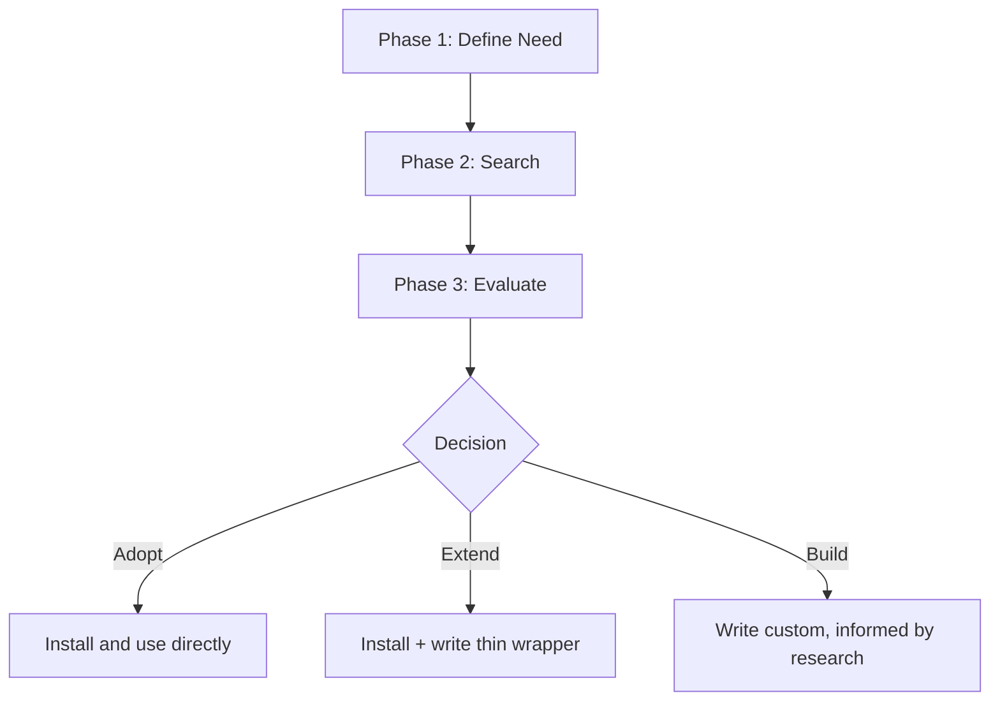

# Search First — Research Before You Code

## Overview

The fastest code is code you don't write. Before implementing anything non-trivial, search for existing tools, libraries, patterns, and prior art. Adopt proven solutions. Build custom only when nothing fits.

**Core principle:** If you haven't searched, you haven't started.

**Violating the letter of the rules is violating the spirit of research.**

## The Iron Law

```
NO CUSTOM CODE WITHOUT SEARCHING FOR EXISTING SOLUTIONS FIRST
```

Wrote a utility before searching? Delete it. Research first. Then decide if custom code is justified.

## When to Use

**Always:**
- Adding new functionality or integrations
- Building utilities, helpers, or abstractions
- Implementing patterns that are likely common (auth, validation, caching, etc.)
- Before adding a dependency you haven't evaluated
- Starting work that "someone must have solved before"

**Exceptions (ask your human partner):**
- Truly domain-specific business logic with no external analog
- One-liner convenience wrappers
- Throwaway prototypes explicitly labeled as such

Thinking "I'll just write it quick"? Stop. That's rationalization.

## The Five Phases



### Phase 1: Define the Need

Before searching, articulate clearly:

1. **What functionality is needed?** — One sentence, specific
2. **What language/framework?** — Constrains the search
3. **What are the constraints?** — License, bundle size, dependencies, performance
4. **How much of this is truly unique?** — Be honest

**Write it down.** Vague needs produce vague searches.

**Example:**
```
Need: HTTP client with automatic retries, exponential backoff, and timeout handling
Stack: TypeScript / Node.js
Constraints: Must support AbortController, no native dependencies
Unique: Nothing — this is a solved problem
```

### Phase 2: Search

Search in this order. Stop as soon as you find a good match.

#### 2a. Search the Current Codebase First

Before looking externally — does this already exist in the project?

```bash
# Search for similar functionality
rg "retry" --type ts -l
rg "backoff" --type ts -l
rg "httpClient\|fetchWithRetry\|resilientFetch" --type ts -l

# Check existing dependencies
cat package.json | grep -i "retry\|fetch\|http\|axios"

# Check utility directories
ls src/utils/ src/lib/ src/helpers/ 2>/dev/null
```

**Found something?** Use it. Don't create duplicates.

#### 2b. Search Package Registries

```bash
# JavaScript/TypeScript
npm search <keyword> 2>/dev/null | head -20

# Python
pip search <keyword> 2>/dev/null || pip index versions <package> 2>/dev/null

# Go
go doc <package> 2>/dev/null
```

Or use brave-search skill to search registries:
- `"npm <keyword> package"` for Node.js
- `"pypi <keyword>"` for Python
- `"crates.io <keyword>"` for Rust
- `"pkg.go.dev <keyword>"` for Go

#### 2c. Search GitHub for Implementations

Use brave-search skill to find well-maintained open-source solutions:

```
"github <keyword> <language> stars:>100"
```

Look for:
- Battle-tested repos (stars, recent commits, active issues)
- Reference implementations of the pattern you need
- Starter templates or boilerplates that solve 80%+ of the problem

#### 2d. Search for Prior Art and Patterns

```
"<problem> best practices <framework>"
"<problem> implementation pattern <language>"
```

Even if you'll write custom code, understanding how others solved it prevents naive mistakes.

### Phase 3: Evaluate

Score each candidate on these criteria:

| Criterion | Weight | What to Check |
|-----------|--------|---------------|
| **Functionality** | High | Does it solve 80%+ of the need? |
| **Maintenance** | High | Last commit < 6 months? Active maintainer? |
| **Community** | Medium | Stars, downloads, open issues response time |
| **Documentation** | Medium | Clear README, API docs, examples? |
| **License** | High | Compatible with project? (MIT/Apache preferred) |
| **Dependencies** | Medium | Minimal transitive deps? No bloat? |
| **Bundle size** | Low-High | Matters for frontend, less for backend |

**Quick evaluation template:**
```
Package: <name>
Solves: <what % of need>
Last updated: <date>
Weekly downloads: <count>
License: <type>
Deps: <count>
Verdict: ADOPT / EXTEND / SKIP
Reason: <one line>
```

### Phase 4: Decide

| Signal | Action |
|--------|--------|
| Exact match, well-maintained, compatible license | **Adopt** — install and use directly |
| Partial match, good foundation | **Extend** — install + write thin wrapper |
| Multiple weak matches | **Compose** — combine 2-3 small packages |
| Nothing suitable after thorough search | **Build** — write custom, informed by research |

**"Build" requires justification.** Document why existing solutions don't fit. If you can't articulate a clear reason, you haven't searched enough.

### Phase 5: Implement the Decision

**If Adopt:**
```bash
npm install <package>  # or pip install, cargo add, etc.
```
Write integration code referencing the library's docs and examples.

**If Extend:**
Install the package, then write a thin project-specific wrapper. The wrapper should:
- Expose only what your project needs
- Add project-specific defaults
- NOT re-implement what the library already does

**If Build:**
- Reference the patterns you found in Phase 2
- Borrow design decisions from well-regarded implementations
- Don't start from scratch — start from understanding
- Follow TDD (invoke test-driven-development skill)

## Integration with Other Skills

### With brainstorming
Research happens BEFORE design exploration. When brainstorming proposes "build X", search-first runs to check if X already exists.

### With writing-plans
Plans should reference research results. Each task that adds functionality should note:
- "Uses `<package>` for X" (adopted)
- "Wraps `<package>` with project adapter" (extended)
- "Custom implementation — no suitable package found because Y" (built)

### With systematic-debugging
When debugging reveals a need for a new utility (retry logic, parsing, etc.), search before writing.

## Common Search Shortcuts

| Category | What to Search | Common Solutions |
|----------|---------------|-----------------|
| HTTP clients | `http client retry timeout` | got, ky, axios, httpx, reqwest |
| Validation | `schema validation` | zod, yup, joi, pydantic, serde |
| Auth | `authentication jwt oauth` | next-auth, passport, jose |
| Database | `orm query builder` | prisma, drizzle, sqlalchemy, diesel |
| Testing | `mock test fixture` | msw, nock, factory-bot, testcontainers |
| Caching | `cache lru ttl` | lru-cache, keyv, node-cache |
| CLI | `cli argument parser` | commander, yargs, clap, click |
| Dates | `date time manipulation` | date-fns, dayjs, luxon, chrono |
| Formatting | `code formatter linter` | prettier, eslint, ruff, rustfmt |
| File processing | `csv json yaml parser` | papaparse, fast-csv, js-yaml |
| PDF/Docs | `pdf generation parsing` | pdfkit, puppeteer, pdfplumber |
| Email | `email sending template` | nodemailer, resend, sendgrid |
| Rate limiting | `rate limit throttle` | bottleneck, p-limit, p-queue |
| Retry | `retry backoff` | p-retry, async-retry, tenacity |
| Logging | `structured logging` | pino, winston, structlog |

## Anti-Patterns

| Anti-Pattern | Why It's Wrong |
|-------------|----------------|
| **Jumping to code** | Writing without searching. You'll build a worse version of something that exists. |
| **Shallow search** | Glancing at one npm result and declaring "nothing fits". Search multiple registries and GitHub. |
| **Over-wrapping** | Wrapping a library so heavily it loses its benefits. Thin wrappers only. |
| **Dependency bloat** | Installing a massive package for one small feature. Check bundle size. |
| **NIH syndrome** | "Not Invented Here" — rejecting good solutions because you didn't write them. |
| **Ignoring the codebase** | Searching externally before checking if the project already has what you need. |
| **"I know a better way"** | You probably don't. Battle-tested > clever homebrew. |

## Common Rationalizations

| Excuse | Reality |
|--------|---------|
| "Writing it myself is faster" | Faster to write, slower to maintain. Libraries get free bug fixes. |
| "No library does exactly what I need" | 80% match + thin wrapper = better than 100% custom. |
| "Dependencies are risk" | So is untested custom code. Well-maintained deps are lower risk. |
| "It's just a small utility" | Small utilities multiply. 20 "small" custom utils = maintenance burden. |
| "I already know how to implement it" | Knowing how ≠ should. Your time is better spent on unique business logic. |
| "The library has too many features" | Import what you need. Tree-shaking handles the rest. |
| "I'll search later" | You won't. And you'll have already written the custom version. |

## Red Flags — STOP and Search

If you catch yourself:
- Writing a utility function > 20 lines without searching first
- Implementing a pattern you've seen in libraries before
- Thinking "this is a common problem but I'll just..."
- Building something that has a Wikipedia article about it
- Copy-pasting a Stack Overflow answer into a utility file
- Saying "I don't need a library for this"

**ALL of these mean: STOP. Search first.**

## Quick Reference

| Phase | Key Activity | Time Budget |
|-------|-------------|-------------|
| **1. Define** | Articulate need, stack, constraints | 1 min |
| **2. Search** | Codebase → registries → GitHub → web | 3-5 min |
| **3. Evaluate** | Score candidates on criteria | 2-3 min |
| **4. Decide** | Adopt / Extend / Build | 30 sec |
| **5. Implement** | Install or write informed by research | Varies |

Total research overhead: **5-10 minutes.** Saves hours of writing, debugging, and maintaining custom code.

## Verification

Before moving to implementation, confirm:

- [ ] Searched current codebase for existing solutions
- [ ] Searched at least one package registry
- [ ] Searched GitHub or web for prior art
- [ ] Evaluated top candidates with criteria
- [ ] Decision documented (Adopt/Extend/Build + reason)
- [ ] If Build: articulated why existing solutions don't fit

Can't check all boxes? You haven't searched enough. Go back to Phase 2.

## Final Rule

```
New functionality → search for existing solutions first
Custom code → justified by documented research
Otherwise → not search-first
```

No exceptions without your human partner's permission.
