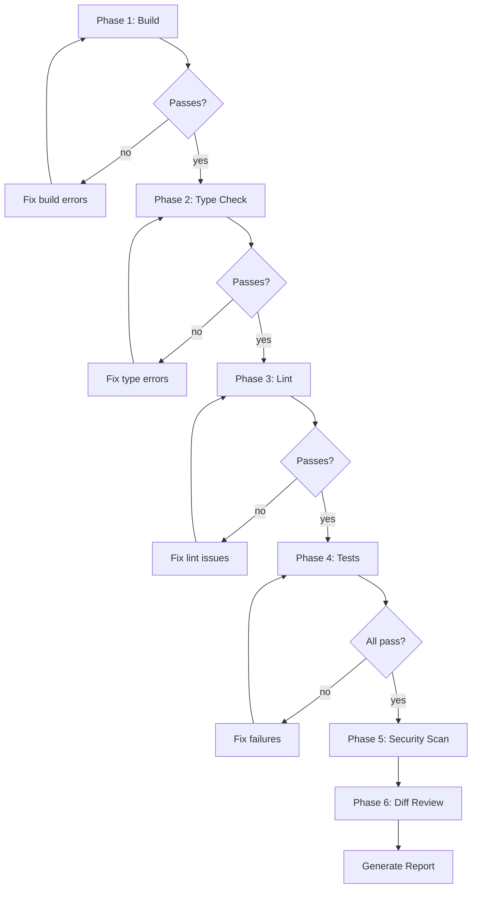

# Verification Before Completion

## Overview

Before claiming any work is complete, run systematic automated verification across 6 phases. Produce a structured report showing pass/fail for each phase.

**Core principle:** Don't assume — verify. What you think works might not.

**Violating the letter of verification is violating the spirit of done.**

## The Iron Law

```
ASSUME NOTHING. VERIFY EVERYTHING.
```

If you haven't verified it, it's not done.

## When to Use

Use before:
- Marking tasks complete
- Presenting finished work
- Requesting code review
- Merging to main
- Declaring bug fixed
- Moving to the next task in a plan

## The Six Phases

Run these in order. Stop and fix before continuing if a phase fails.



### Phase 1: Build Verification

Confirm the project compiles and builds without errors.

**Detect build system and run:**

| Indicator | Command |
|-----------|---------|
| `package.json` with `build` script | `npm run build 2>&1 \| tail -20` |
| `tsconfig.json` (TS-only project) | `npx tsc --noEmit 2>&1 \| head -30` |
| `Cargo.toml` | `cargo build 2>&1 \| tail -20` |
| `go.mod` | `go build ./... 2>&1` |
| `pom.xml` | `mvn compile -q 2>&1 \| tail -20` |
| `build.gradle.kts` | `./gradlew build 2>&1 \| tail -20` |
| `pyproject.toml` / `setup.py` | `python -m py_compile <changed files>` |

**If build fails → STOP. Fix before continuing.**

Record: `Build: PASS` or `Build: FAIL — <error summary>`

### Phase 2: Type Check

Run static type checking independent of build.

| Stack | Command |
|-------|---------|
| TypeScript | `npx tsc --noEmit --pretty 2>&1 \| head -30` |
| Python (typed) | `pyright . 2>&1 \| head -30` or `mypy . 2>&1 \| head -30` |
| Go | `go vet ./... 2>&1` |
| Rust | `cargo clippy -- -D warnings 2>&1 \| head -30` |

**If type errors found → fix critical ones before continuing.**

Record: `Types: PASS` or `Types: FAIL — X errors`

### Phase 3: Lint Check

Run linter for the project's language/framework.

| Stack | Command |
|-------|---------|
| JS/TS | `npm run lint 2>&1 \| head -30` or `npx eslint . --ext .ts,.tsx 2>&1 \| head -30` |
| Python | `ruff check . 2>&1 \| head -30` or `flake8 . 2>&1 \| head -30` |
| Go | `golangci-lint run 2>&1 \| head -30` or `staticcheck ./... 2>&1` |
| Rust | `cargo fmt --check 2>&1` |

Record: `Lint: PASS` or `Lint: WARN — X warnings` or `Lint: FAIL — X errors`

### Phase 4: Test Suite

Run tests with coverage if available.

| Stack | Command |
|-------|---------|
| JS/TS (Jest) | `npx jest --coverage --coverageReporters=text-summary 2>&1 \| tail -30` |
| JS/TS (Vitest) | `npx vitest run --coverage 2>&1 \| tail -30` |
| Python | `pytest --tb=short -q 2>&1 \| tail -30` |
| Go | `go test ./... -count=1 2>&1 \| tail -30` |
| Rust | `cargo test 2>&1 \| tail -30` |

**Extract and record:**
- Total tests
- Passed / Failed / Skipped
- Coverage percentage (if available)
- Target: 80%+ coverage

Record: `Tests: PASS — X/Y passed, Z% coverage` or `Tests: FAIL — X failures`

**If tests fail → STOP. Fix before continuing.**

### Phase 5: Security Scan

Quick scan for common security issues in changed files.

```bash
# Get changed files
CHANGED=$(git diff --name-only HEAD 2>/dev/null || git diff --name-only)

# Check for hardcoded secrets
grep -rn "sk-\|api_key\|API_KEY\|secret.*=.*['\"]" $CHANGED 2>/dev/null | grep -v test | head -10

# Check for hardcoded passwords
grep -rn "password.*=.*['\"]" $CHANGED 2>/dev/null | grep -v test | grep -v ".env.example" | head -10

# Check for console.log / print statements left in source
grep -rn "console\.log\|console\.debug\|print(" $CHANGED 2>/dev/null | grep -v test | grep -v "\.test\." | head -10

# Check for TODO/FIXME/HACK left behind
grep -rn "TODO\|FIXME\|HACK\|XXX" $CHANGED 2>/dev/null | head -10

# Check for disabled eslint rules
grep -rn "eslint-disable" $CHANGED 2>/dev/null | head -10

# Dependency audit (if applicable)
npm audit --audit-level=high 2>/dev/null | tail -5
```

Record: `Security: PASS` or `Security: WARN — X issues found`

**Critical security issues (hardcoded secrets) → STOP. Fix immediately.**

### Phase 6: Diff Review

Review what actually changed to catch unintended modifications.

```bash
# Summary of changes
git diff --stat HEAD 2>/dev/null || git diff --stat

# Files changed
git diff --name-only HEAD 2>/dev/null || git diff --name-only
```

**Check each changed file for:**
- [ ] Only relevant files changed (no accidental edits)
- [ ] No unintended changes to unrelated code
- [ ] No debug code or temporary hacks left
- [ ] No commented-out code blocks
- [ ] Error handling present for new code paths
- [ ] Naming is clear and consistent

Record: `Diff: X files changed — reviewed`

## The Verification Report

After running all 6 phases, produce this structured report:

```
═══════════════════════════════════════
        VERIFICATION REPORT
═══════════════════════════════════════

Build:      [PASS/FAIL]
Types:      [PASS/FAIL] (X errors)
Lint:       [PASS/FAIL] (X warnings)
Tests:      [PASS/FAIL] (X/Y passed, Z% coverage)
Security:   [PASS/FAIL] (X issues)
Diff:       X files changed — reviewed

───────────────────────────────────────
Overall:    [✅ READY / ❌ NOT READY] for completion
───────────────────────────────────────

Issues to Fix:
1. ...
2. ...

Notes:
- ...
```

## Decision Rules

| Condition | Verdict |
|-----------|---------|
| All 6 phases PASS | ✅ **READY** — proceed with completion |
| Build or Tests FAIL | ❌ **NOT READY** — fix before anything else |
| Type errors exist | ❌ **NOT READY** — fix type errors |
| Security CRITICAL found | ❌ **NOT READY** — fix immediately |
| Lint warnings only | ⚠️ **CONDITIONAL** — acceptable if minor, note in report |
| Console.log in source | ⚠️ **CONDITIONAL** — remove unless intentional logging |
| Coverage < 80% | ⚠️ **CONDITIONAL** — note gap, add tests if time permits |

## Continuous Verification

For long sessions, don't wait until the end. Run verification at natural checkpoints:

| Checkpoint | When |
|-----------|------|
| After completing each function/component | Quick check (Phase 1 + 4) |
| After finishing a plan task | Full 6-phase verification |
| Before switching to a different task | Full 6-phase verification |
| Before requesting code review | Full 6-phase verification |
| After addressing review feedback | Full 6-phase verification |

## Common Oversights

| Oversight | What to Check |
|-----------|---------------|
| Edge cases | Empty input, null, undefined, zero, negative, max int |
| Error handling | Network failure, timeout, invalid response, disk full |
| Race conditions | Parallel operations, shared state, concurrent writes |
| Performance | O(n²) loops, unbounded queries, missing pagination |
| Security | Injection, XSS, CSRF, auth bypass, data exposure |
| Accessibility | Keyboard nav, screen readers, color contrast |
| Mobile/responsive | Small screens, touch targets, viewport |

## Red Flags — STOP

**If you catch yourself:**
- Saying "it should work" without running tests
- Skipping build because "I only changed one file"
- Assuming type check passes because IDE shows no errors
- Not running the full test suite
- Ignoring lint warnings "for now"
- Thinking "security scan not needed for this change"
- Rushing to mark complete because you're tired

**ALL of these mean: STOP. Run the 6 phases.**

## When Issues Are Found

If verification reveals issues:

1. **Don't claim completion** — ever, not "with caveats"
2. **Fix the issues** — starting with Critical, then High, then Medium
3. **Re-verify from Phase 1** — don't assume fixes worked
4. **Update the report** — show before/after

## Integration

Used by:
- **finishing-development** — Before presenting merge options
- **subagent-development** — After each task completion
- **executing-plans** — After each batch

Related skills:
- **test-driven-development** — Ensures tests exist before verification
- **systematic-debugging** — Fix issues found during verification
- **search-first** — If fix requires new utility, research first

## Final Rule

```
Think you're done → run 6 phases → report says READY → then you're done
Report says NOT READY → fix → re-verify
Otherwise → not done
```

No exceptions without your human partner's permission.
