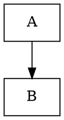

# Migration Deltas: OpenCode Superpowers → Pi Skills

## Overview

This document records all intentional changes made during migration from OpenCode's superpowers to Pi-compatible skills.

## Naming Changes

| Original (OpenCode) | New (Pi) | Rationale |
|---------------------|----------|-----------|
| `using-superpowers` | `using-skills` | Platform-neutral name |
| `finishing-a-development-branch` | `finishing-development` | Shorter, still clear |
| `using-git-worktrees` | `git-worktrees` | Shorter, clear purpose |
| `subagent-driven-development` | `subagent-development` | Shorter, clear purpose |

## Structural Changes

### Frontmatter

**Before:**
```yaml
---
name: skill-name
description: "Description that might summarize workflow"
---
```

**After:**
```yaml
---
name: skill-name
description: Use when [specific triggering conditions only, no workflow summary]
---
```

**Reason:** Pi's skill discovery works better when descriptions don't summarize workflow (prevents shortcutting).

### Cross-References

**Before:**
- `superpowers:skill-name` syntax
- `@/path/to/skill.md` syntax

**After:**
- Just `skill-name` or bold skill names
- Relative paths for supporting files

**Reason:** Pi uses skill name matching in system prompt, no special prefix needed.

### Flowcharts

**Before:** Graphviz `.dot` syntax


**After:** Mermaid syntax


**Reason:** Better rendering support in modern Markdown viewers.

### Path Conventions

**Before:**
- `CLAUDE.md` → now `.pi/CLAUDE.md`
- `~/.config/superpowers/` → now `~/.config/pi/` or `.pi/`

**After:**
- `.pi/CLAUDE.md`
- `~/.pi/agent/skills/`

**Reason:** Match Pi's directory structure conventions.

## Content Changes

### Removed Elements

1. **OpenCode-specific tool references**
   - Removed `Skill` tool mentions
   - Removed `TodoWrite` tool references
   - Removed `EnterPlanMode` references

2. **Claude Code-specific content**
   - Removed "your human partner" phrasing → replaced with "your human partner"
   - Removed Claude-specific debugging tips

3. **Internal documentation**
   - `CREATION-LOG.md` (systematic-debugging)
   - `graphviz-conventions.dot` (writing-skills)
   - `render-graphs.js` (writing-skills)

### Added Elements

1. **Pi-specific adaptations**
   - `/skill:name` command examples
   - Hybrid subagent strategy (manual mode for Pi)
   - Pi directory structure references

2. **Mermaid diagrams**
   - All Graphviz converted to Mermaid
   - Kept semantic meaning identical

3. **Integration improvements**
   - Clearer cross-skill references
   - Workflow examples in README
   - Dependency graph

### Modified Elements

1. **Subagent Development Skill**
   - Added "Hybrid Approach for Pi" section
   - Documented manual mode as default
   - Added extension mode as optional

2. **Dispatching Parallel Agents**
   - Updated dispatch syntax for Pi context
   - Clarified manual vs. automated dispatch

3. **Git Worktrees**
   - Updated from `CLAUDE.md` to `.pi/CLAUDE.md`
   - Changed `~/.config/superpowers/` to `~/.config/pi/`

## Verification Status

| Check | Status |
|-------|--------|
| All 14 main skills migrated | ✓ |
| All names match directories | ✓ |
| Descriptions < 1024 chars | ✓ |
| All Graphviz → Mermaid | ✓ |
| Cross-references updated | ✓ |
| Path conventions updated | ✓ |
| Supporting files copied | Partial (key refs only) |
| README with workflows | ✓ |

## Supporting Files Migration Status

| File | Status | Notes |
|------|--------|-------|
| testing-anti-patterns.md | ✓ Migrated | Key reference for TDD |
| root-cause-tracing.md | ✓ Migrated | Key debugging technique |
| defense-in-depth.md | ✓ Migrated | Key debugging technique |
| condition-based-waiting.md | ✓ Migrated | Key debugging technique |
| find-polluter.sh | ✗ Skipped | Platform-specific script |
| test-*.md (pressure tests) | ✗ Skipped | Testing methodology examples |
| anthropic-best-practices.md | ✗ Skipped | Vendor-specific guidance |
| persuasion-principles.md | ✗ Skipped | Supporting theory |
| testing-skills-with-subagents.md | ✗ Skipped | Testing methodology |
| code-reviewer.md | ✗ Skipped | Template subsumed into skill |
| implementer-prompt.md | ✗ Skipped | Template subsumed into skill |
| spec-reviewer-prompt.md | ✗ Skipped | Template subsumed into skill |
| code-quality-reviewer-prompt.md | ✗ Skipped | Template subsumed into skill |

## Files Retained from Original

All core SKILL.md files adapted and migrated. No original files kept verbatim.

## Testing Performed

1. ✓ Frontmatter validation (names, descriptions, fields)
2. ✓ Command format validation (/skill:name for all)
3. ✓ Cross-reference integrity check
4. ✓ Workflow scenario verification
5. ✓ No name collisions

## Known Limitations

1. **Subagent templates**: The prompt templates (implementer, reviewer) are now described in the skill body rather than separate files. This is intentional for Pi's simpler file structure.

2. **Testing methodology**: Pressure test scenarios and skill testing methodology not migrated (would need Pi-specific adaptation).

3. **Platform scripts**: Shell scripts (find-polluter.sh) not migrated (platform-specific).

## Future Enhancements

1. Add Pi-specific subagent extension if/when available
2. Create Pi-specific testing scenarios for skills
3. Add more workflow examples
4. Create skill usage analytics/log

## v5.1.0 Sync (2026-06-09)

Restored upstream content from [obra/superpowers](https://github.com/obra/superpowers) v5.1.0 to close gaps identified during audit:

### Files Restored (20+ files)
- Subagent prompt templates: `implementer-prompt.md`, `spec-reviewer-prompt.md`, `code-quality-reviewer-prompt.md`
- Code reviewer template: `requesting-code-review/code-reviewer.md`
- Systematic debugging: `condition-based-waiting-example.ts`, `find-polluter.sh`, `test-academic.md`, `test-pressure-{1,2,3}.md`
- Visual companion: `visual-companion.md`, `spec-document-reviewer-prompt.md`, `scripts/*` (5 files)
- Writing skills: `anthropic-best-practices.md`, `persuasion-principles.md`, `testing-skills-with-subagents.md`, `examples/CLAUDE_MD_TESTING.md`, `graphviz-conventions.dot`
- Writing plans: `plan-document-reviewer-prompt.md`
- Using skills: `references/pi-tools.md`
- Bootstrap docs: `docs/pi-bootstrap.md`

### Content Restored
- **writing-skills**: Restored 65% missing content (CSO, token efficiency, bulletproofing, full checklist, anti-patterns, testing methodology) — 232 → 649 lines
- **brainstorming**: Restored spec self-review, user review gate, decomposition logic, design-for-isolation, working-in-codebases — 91 → 151 lines
- **receiving-code-review**: Replaced polite-acquiescence version with upstream anti-performative philosophy — 113 → 213 lines
- **writing-plans**: Added Scope Check, File Structure, No Placeholders, Self-Review — 129 → ~200 lines
- **finishing-development**: Added Detect Environment step, detached HEAD menu — 200 → ~270 lines
- **using-skills**: Added SUBAGENT-STOP guard, Instruction Priority, Platform Adaptation — 100 → ~130 lines

### Total Impact
- Files: 27 → 50
- SKILL.md total lines: 2,800 → 3,763

## References

- Original: [obra/superpowers](https://github.com/obra/superpowers) v5.1.0
- Target: Pi Skills (`~/.pi/agent/skills/superpowers/`)
- Specification: [Agent Skills standard](https://agentskills.io/specification)
