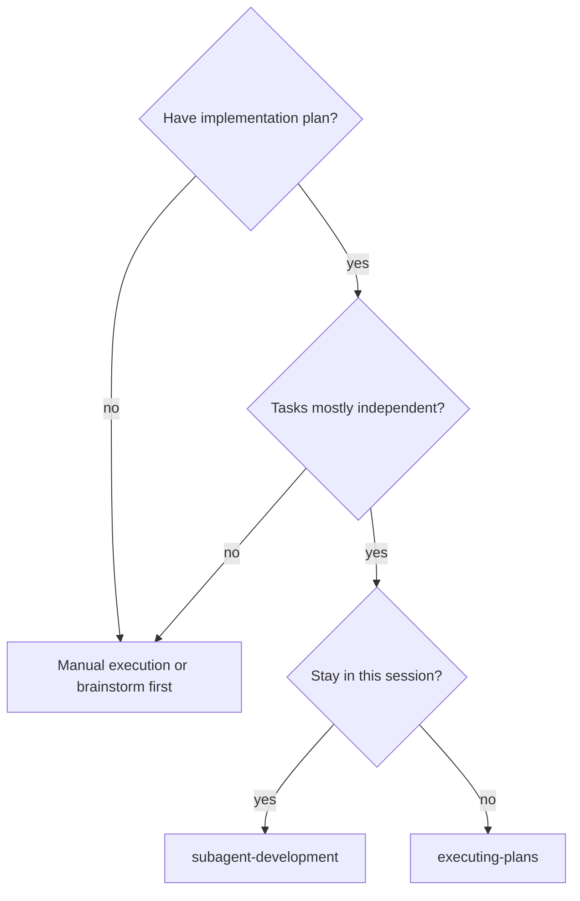
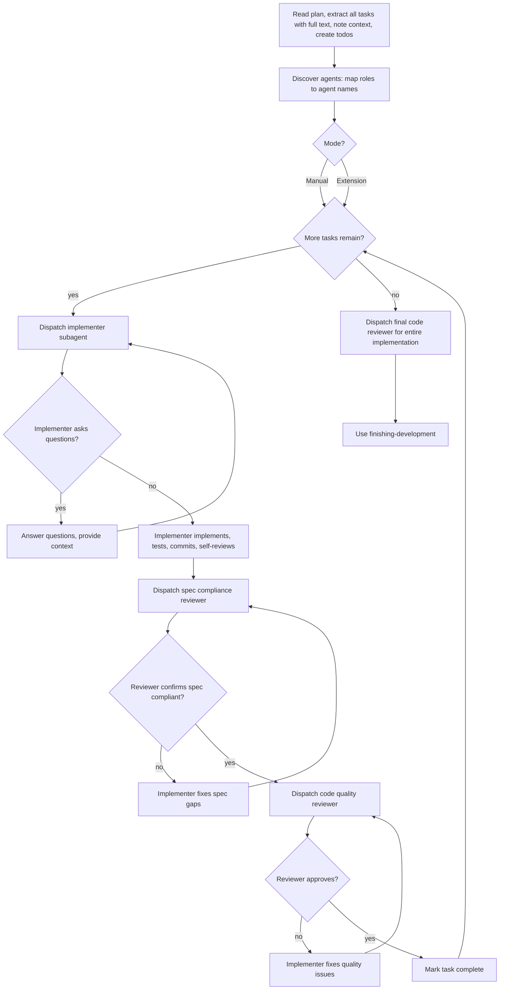

# Subagent-Driven Development

Execute plan by dispatching fresh subagent per task, with two-stage review after each: spec compliance review first, then code quality review.

**Core principle:** Fresh subagent per task + two-stage review (spec then quality) = high quality, fast iteration

## When to Use



**vs. Executing Plans (parallel session):**
- Same session (no context switch)
- Fresh subagent per task (no context pollution)
- Two-stage review after each task: spec compliance first, then code quality
- Faster iteration (no human-in-loop between tasks)

## The Process



### 0. Discover Agents & Select Mode

Before starting execution, discover available agents:

1. **List user-level agents** — Read the directory `~/.pi/agent/agents/` (always available if it exists)
2. **List project-level agents** — Read `.pi/agents/` in the current project (if it exists)
3. **Identify role mappings** — Map each discovered agent to a role based on its name and description:
   - **Implementer role**: Agents with names like `worker`, `implementer`, `dev`, `coder` or descriptions mentioning implementation
   - **Reviewer role**: Agents with names like `reviewer`, `review`, `qa`, `auditor` or descriptions mentioning review/quality
4. **Verify Extension Mode readiness** — Extension Mode requires at least one implementer-role agent AND one reviewer-role agent

Then present the mode choice to the user, including discovered agents:

> "I'll execute this plan using subagent-development. I found these agents:
>
> | Agent | Role | Source |
> |-------|------|--------|
> | `worker` | Implementer | user |
> | `reviewer` | Reviewer | user |
>
> Which mode would you like?"
>
> **A) Manual Mode** — You implement each task while I guide and review. Works in any Pi setup.
> **B) Extension Mode** — I dispatch subagents to implement and review. Requires at least one implementer-role and one reviewer-role agent.

If Extension Mode is selected but the required roles are not covered, inform the user and fall back to Manual Mode:

> "Extension Mode requires at least one implementer-role agent and one reviewer-role agent. I checked:
> - User-level: `~/.pi/agent/agents/` — [found X agents: names]
> - Project-level: `.pi/agents/` — [found Y agents: names or "not found"]
>
> Missing roles: [implementer and/or reviewer]. Falling back to Manual Mode."

## The Pattern

### 1. Read Plan Once
- Extract all tasks with full text and context
- Create todo items for each task **and** a durable progress file `docs/plans/<plan-name>-progress.md` (one checkbox per task). Update it as each task completes — in-memory todos alone are lost on session end, which blocks resuming a crashed or handed-off run.

### 2. Per Task: Dispatch Implementer
- Provide full task text + context
- Implementer follows TDD (test-driven-development skill)
- Implementer self-reviews before returning

### 3. Per Task: Spec Compliance Review
- Verify implementation matches spec exactly
- Check: All requirements met? Nothing extra added?
- If issues: Implementer fixes, review again

### 4. Per Task: Code Quality Review
- Check: Good test coverage? Clean code? No magic numbers?
- If issues: Implementer fixes, review again

### 5. After All Tasks: Final Review
- Review entire implementation
- Use finishing-development skill to complete

## Manual Mode

In Manual Mode, you (the agent) act as the controller while the user implements:

1. **Present task** — Give user the full task text + context
2. **User implements** — User writes code, you guide and answer questions
3. **You review (spec compliance)** — Use the Spec Compliance Checklist below
4. **You review (code quality)** — Reference the requesting-code-review skill
5. **Loop or proceed** — If review fails, user fixes and you re-review (max 3 cycles)
6. **Commit** — User commits when both reviews pass
7. **Next task** — Move to the next task

### Spec Compliance Checklist

Verify the implementation matches the task spec exactly:

- [ ] All explicit requirements from the task are implemented
- [ ] No extra features added beyond what the spec requires
- [ ] Edge cases mentioned in the task spec are handled
- [ ] No changes to files or components outside the task scope
- [ ] Tests cover the behavior specified in the task

If any checklist item fails → send back to implementer with specific gaps to address.

### Code Quality Review

After spec compliance passes, review code quality using the **requesting-code-review** skill checklist:

- Test coverage and test quality
- Code clarity and naming
- No magic numbers or hardcoded values
- Proper error handling
- Follows project coding standards

## Extension Mode

In Extension Mode, you dispatch subagents for implementation and review:

1. **Dispatch implementer** — Send task + context to implementer subagent
2. **Implementer works** — Follows TDD, self-reviews, commits
3. **Dispatch spec reviewer** — Verify spec compliance using the checklist
4. **Dispatch quality reviewer** — Verify code quality using requesting-code-review
5. **Loop or proceed** — If review fails, dispatch implementer to fix (max 3 cycles)
6. **Next task** — Move to the next task

### Role-to-Agent Mapping

Agent names vary per setup. Use the role mappings discovered in Step 0:
- `<implementer-agent>` — the agent mapped to the implementer role (e.g., `worker`, `implementer`, `dev`)
- `<reviewer-agent>` — the agent mapped to the reviewer role (e.g., `reviewer`, `qa`, `auditor`)

If multiple agents match a role, prefer the one with the broadest description (general-purpose > specialized).

### Subagent Dispatch Patterns

Use the `subagent` tool with these parameter shapes. `agentScope` defaults to `"user"`; set to `"both"` if your reviewer is a project-level agent.

**Resumable chains:** When you express a multi-step task as a `chain`, the `subagent` tool persists progress to `.pi/runs/<id>.json` after every step. If a step fails, the result reports its `runId` — re-invoke with the same `chain` and that `runId` to skip already-completed steps and resume from the failure. This is the durable-state counterpart to the progress file for agent-driven work.

**Implementer dispatch:**

```
subagent({
  agent: "<implementer-agent>",
  task: `[full task text from plan]

Context: [relevant files, dependencies, constraints]

Requirements:
- Follow test-driven-development skill
- Write tests first, then implementation
- Commit when all tests pass
- Self-review before returning

Report: What you implemented, tests added, any blockers`,
  agentScope: "user"
})
```

**Spec compliance reviewer dispatch:**

```
subagent({
  agent: "<reviewer-agent>",
  task: `Review spec compliance for task: [task name]

Task spec:
[full task text]

Files changed: [list of modified/created files]

Checklist:
- [ ] All explicit requirements implemented
- [ ] No extra features beyond spec
- [ ] Edge cases handled
- [ ] No scope creep
- [ ] Tests cover specified behavior

Report: PASS or FAIL with specific gaps`,
  agentScope: "user"
})
```

**Code quality reviewer dispatch:**

```
subagent({
  agent: "<reviewer-agent>",
  task: `Review code quality for task: [task name]

Files changed: [list of modified/created files]

Use the requesting-code-review skill checklist:
- Test coverage and quality
- Code clarity and naming
- No magic numbers
- Error handling
- Coding standards

Report: PASS or FAIL with specific issues`,
  agentScope: "user"
})
```

## Review Loop Limit

**Maximum 3 review cycles per task.** After 3 failed attempts, stop and escalate:

1. **Stop the loop** — Don't attempt another review cycle
2. **Present the issue to the user:**
   - Original task spec
   - What's failing (spec compliance or code quality)
   - Specific issues found in each attempt
   - What was tried to fix them
3. **Ask the user how to proceed:**
   - **Clarify the spec** — If requirements are ambiguous
   - **Pair-program** — Work together to resolve the issue
   - **Skip the task** — Move on and revisit later
   - **Abort the plan** — Stop execution entirely

This prevents endless loops and surfaces ambiguous specs early.

## Example Workflow (Manual Mode)

```
You: I'll execute this plan using subagent-development. Which mode?
    A) Manual Mode — You implement, I review
    B) Extension Mode — I dispatch subagents

User: A, Manual Mode

You: Great. I've read the plan and identified 5 tasks.
    Tracking in: docs/plans/feature-plan-tasks.md

    Starting Task 1: Hook installation script

    [Present full task text + context]

    Ready for you to implement. Let me know when done or if you have questions.

User: [implements] Done!

You: Reviewing spec compliance...
    ✅ All requirements met
    ✅ No scope creep
    ⚠️ Missing: edge case for empty config file

    Please add handling for empty config, then I'll re-review.

User: [fixes] Fixed.

You: Spec compliance: ✅
    Code quality review...
    ✅ Good test coverage
    ✅ Clean code
    Approved!

    Please commit, then we'll move to Task 2.

User: Committed.

You: Task 1 complete. Moving to Task 2...
    [Continue...]

[After all tasks]

You: All 5 tasks complete. Using finishing-development skill...
```

## Example Workflow (Extension Mode)

```
You: Discovering agents...
    User-level (~/.pi/agent/agents/):
    - worker (implementer role): General-purpose implementation agent
    - reviewer (reviewer role): Code review and quality assurance

    Project-level (.pi/agents/): not found

    I'll execute this plan using subagent-development. Which mode?
    A) Manual Mode — You implement, I review
    B) Extension Mode — I dispatch subagents (worker → implement, reviewer → review)

User: B, Extension Mode

You: Using worker for implementation, reviewer for review.

    Starting Task 1: Hook installation script

    [Dispatch worker subagent]
    worker: Implemented, tests pass, committed.

    [Dispatch reviewer subagent for spec compliance]
    reviewer: FAIL - missing empty config edge case

    [Dispatch worker subagent to fix]
    worker: Fixed, tests pass, amended commit.

    [Dispatch reviewer subagent for spec compliance]
    reviewer: PASS

    [Dispatch reviewer subagent for code quality]
    reviewer: PASS

    Task 1 complete. Moving to Task 2...
    [Continue...]

[After all tasks]

You: All tasks complete. Using finishing-development skill...
```

## Advantages

**vs. Manual execution:**
- Structured review checkpoints
- Two-stage quality gates: spec then code quality
- Clear task boundaries with verification

**Efficiency gains:**
- Controller curates exactly what context is needed
- Review loops ensure fixes actually work

**Quality gates:**
- Self-review catches issues before handoff
- Two-stage review: spec compliance, then code quality
- Review loops ensure fixes actually work

## Red Flags

**Never:**
- Start implementation on main/master branch without explicit user consent
- Skip reviews (spec compliance OR code quality)
- Proceed with unfixed issues
- Move to next task while either review has open issues
- Start code quality review before spec compliance is approved
- Exceed 3 review cycles without escalating to user

**Always:**
- Ask user to select mode before starting
- Verify tests pass before offering completion options
- Track tasks in a durable progress file `docs/plans/<plan-name>-progress.md` (mandatory — update per task, not just in-conversation todos, so a crashed or handed-off run resumes)
- Escalate to user after 3 failed review cycles
- Use finishing-development skill when all tasks complete

## Integration

**Required workflow skills:**
- **git-worktrees** — REQUIRED: Set up isolated workspace before starting
- **writing-plans** — Creates the plan this skill executes
- **finishing-development** — Complete development after all tasks
- **requesting-code-review** — Code quality review checklist (both modes)

**Subagents should use:**
- **test-driven-development** — Follow TDD for each task

**Alternative workflow:**
- **executing-plans** — Use for parallel session instead of same-session execution

**Mode selection:**
- Manual Mode works with any Pi setup
- Extension Mode requires at least one implementer-role agent and one reviewer-role agent, discovered from:
  - User-level: `~/.pi/agent/agents/` (checked by default)
  - Project-level: `.pi/agents/` (use `agentScope: "both"` to include)
- Agents are matched to roles by name and description (e.g., `worker` → implementer, `reviewer` → reviewer)
