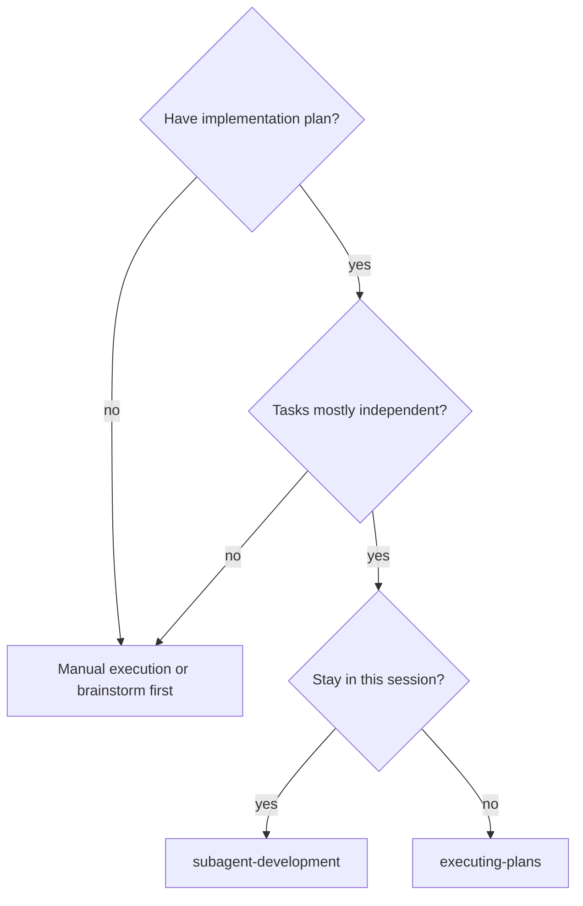
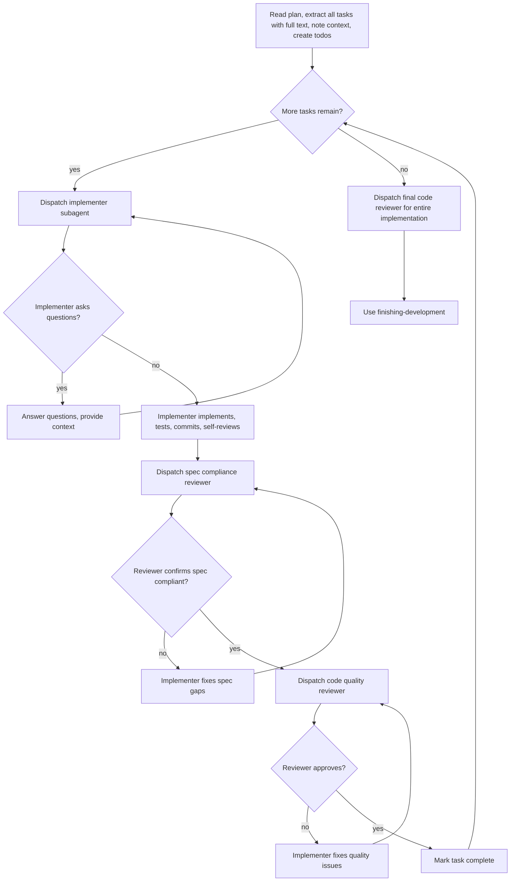

# Subagent-Driven Development

Execute plan by dispatching fresh subagent per task, with two-stage review after each: spec compliance review first, then code quality review.

**Core principle:** Fresh subagent per task + two-stage review (spec then quality) = high quality, fast iteration

## When to Use



**vs. Executing Plans (parallel session):**
- Same session (no context switch)
- Fresh subagent per task (no context pollution)
- Two-stage review after each task: spec compliance first, then code quality
- Faster iteration (no human-in-loop between tasks)

## The Process



## The Pattern

### 1. Read Plan Once
- Extract all tasks with full text and context
- Create todo items for each task

### 2. Per Task: Dispatch Implementer
- Provide full task text + context
- Implementer follows TDD (test-driven-development skill)
- Implementer self-reviews before returning

### 3. Per Task: Spec Compliance Review
- Verify implementation matches spec exactly
- Check: All requirements met? Nothing extra added?
- If issues: Implementer fixes, review again

### 4. Per Task: Code Quality Review
- Check: Good test coverage? Clean code? No magic numbers?
- If issues: Implementer fixes, review again

### 5. After All Tasks: Final Review
- Review entire implementation
- Use finishing-development skill to complete

## Hybrid Approach for Pi

Since Pi may not have native subagent dispatch, use this approach:

**Manual Mode (default):**
- Present task to user with clear scope
- User executes task while you guide
- After each step, do spec and quality review
- Continue to next task

**Extension Mode (if available):**
- If Pi subagent extension is available, use it
- Otherwise fall back to manual mode

## Example Workflow

```
You: I'm using subagent-development to execute this plan.

[Read plan file: docs/plans/feature-plan.md]
[Extract all 5 tasks with full text]
[Create todo list]

Task 1: Hook installation script

[Get Task 1 text and context]
[Present to user as implementer task]

User implements...
You: Reviewing spec compliance...
Spec reviewer: ✅ All requirements met

You: Reviewing code quality...
Code reviewer: Issues found: magic number 100

User fixes...
You: Approved. Marking Task 1 complete.

[Continue to Task 2...]

[After all tasks]
[Use finishing-development]
```

## Advantages

**vs. Manual execution:**
- Structured review checkpoints
- Two-stage quality gates: spec then code quality
- Clear task boundaries with verification

**Efficiency gains:**
- Controller curates exactly what context is needed
- Review loops ensure fixes actually work

**Quality gates:**
- Self-review catches issues before handoff
- Two-stage review: spec compliance, then code quality
- Review loops ensure fixes actually work

## Red Flags

**Never:**
- Start implementation on main/master branch without explicit user consent
- Skip reviews (spec compliance OR code quality)
- Proceed with unfixed issues
- Move to next task while either review has open issues
- Start code quality review before spec compliance is approved

**Always:**
- Verify tests before offering options
- Present exactly 4 options at completion
- Get typed confirmation for discard
- Clean up worktree when appropriate

## Integration

**Required workflow skills:**
- **git-worktrees** - REQUIRED: Set up isolated workspace before starting
- **writing-plans** - Creates the plan this skill executes
- **finishing-development** - Complete development after all tasks
- **requesting-code-review** - Code review template for reviewer subagents

**Subagents should use:**
- **test-driven-development** - Follow TDD for each task

**Alternative workflow:**
- **executing-plans** - Use for parallel session instead of same-session execution
