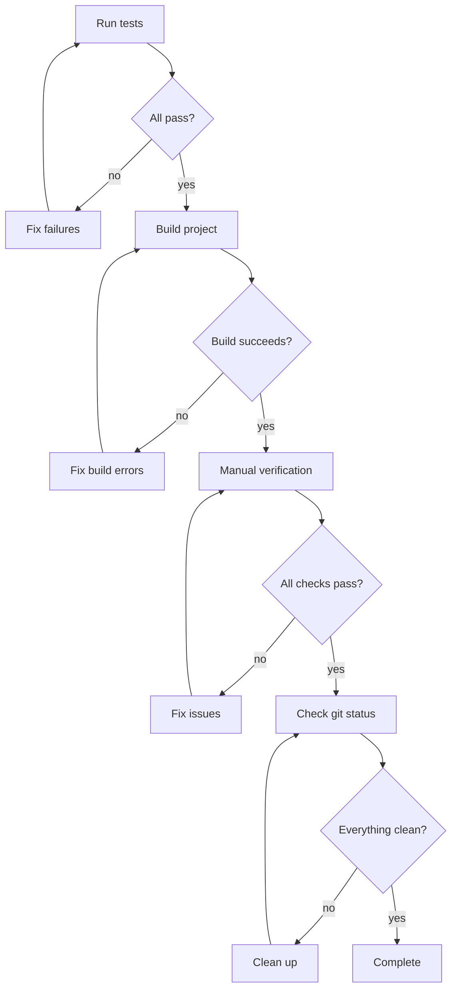

# Verification Before Completion

## Overview

Before claiming any work is complete, systematically verify that everything works correctly.

**Core principle:** Don't assume - verify. What you think works might not.

## The Iron Law

```
ASSUME NOTHING. VERIFY EVERYTHING.
```

If you haven't verified it, it's not done.

## When to Use

Use before:
- Marking tasks complete
- Presenting finished work
- Requesting code review
- Merging to main
- Declaring bug fixed

## Verification Checklist

### 1. Tests Pass

```bash
# Run full test suite
npm test
# or
cargo test
# or
pytest
# or
go test ./...
```

- [ ] All tests pass
- [ ] No new warnings
- [ ] No lint errors

### 2. Code Compiles

```bash
# Build the project
npm run build
# or
cargo build
# or
go build ./...
```

- [ ] No build errors
- [ ] No type errors (if using TypeScript)
- [ ] No linter errors

### 3. Manual Verification

- [ ] Feature works as expected
- [ ] Edge cases handled
- [ ] Error messages are clear

### 4. Code Quality

- [ ] No debug code left (console.log, print statements)
- [ ] No commented-out code
- [ ] Naming is clear
- [ ] No magic numbers

### 5. Documentation

- [ ] Comments explain why (not what)
- [ ] Complex logic has explanations
- [ ] README updated if needed

### 6. Git Status

```bash
git status
git diff --stat
```

- [ ] Only relevant files changed
- [ ] Commit messages are clear
- [ ] No sensitive data committed

## The Verification Flow



## Common Oversights

| Oversight | What to Check |
|-----------|---------------|
| Edge cases | What happens with empty input? Invalid input? |
| Error handling | What happens on network failure? |
| Race conditions | What if operations run in parallel? |
| Performance | Is there a better algorithm? |
| Security | Any injection risks? |
| Accessibility | Works with screen readers? |

## Red Flags

**STOP if:**
- Any test fails
- Build has errors
- You haven't manually tested
- There's debug code left
- You're rushing to finish

**ALWAYS:**
- Run full test suite
- Build from clean state
- Verify manually
- Check git status

## When Issues Found

If verification reveals issues:

1. Don't claim completion
2. Fix the issues
3. Re-verify (don't assume fixes worked)

## Integration

Used by:
- **finishing-development** - Before presenting merge options
- **subagent-development** - After each task completion
- **executing-plans** - After each batch

Related skills:
- **test-driven-development** - Ensures tests exist
- **systematic-debugging** - Fix issues found
